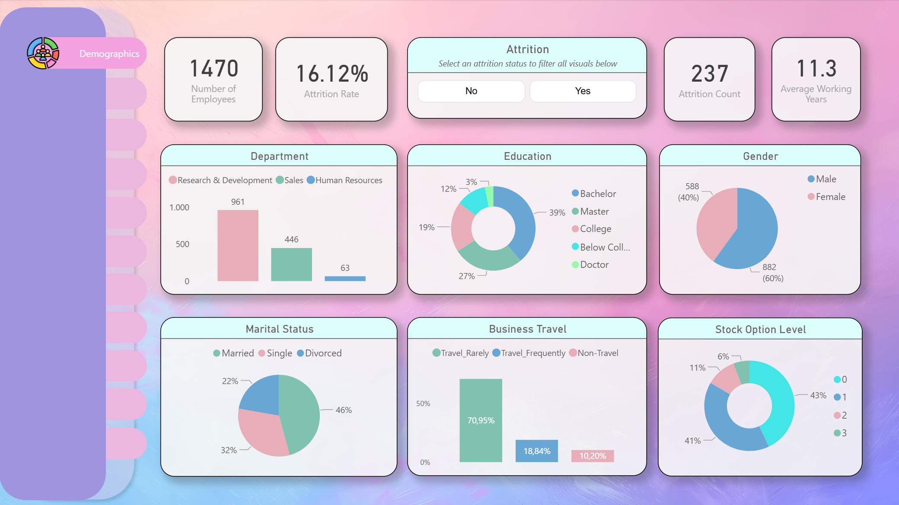
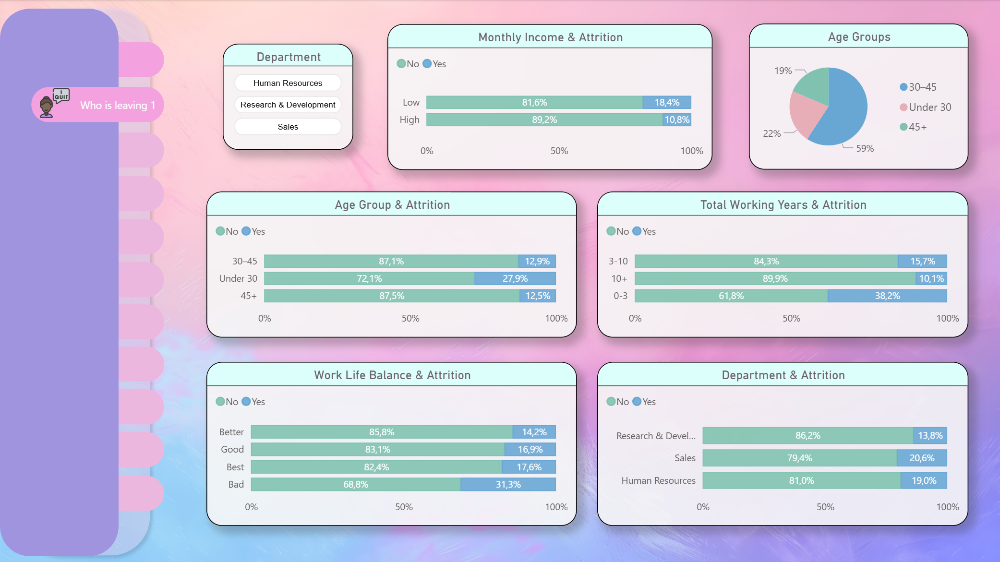
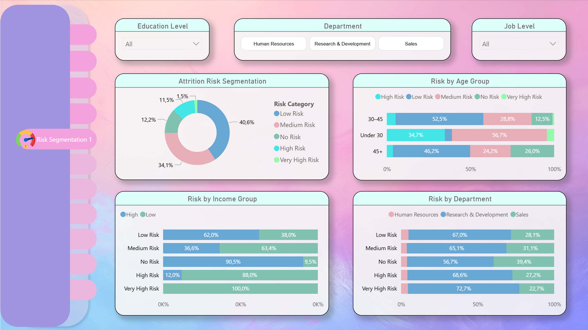
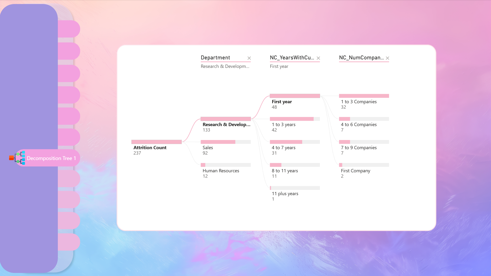
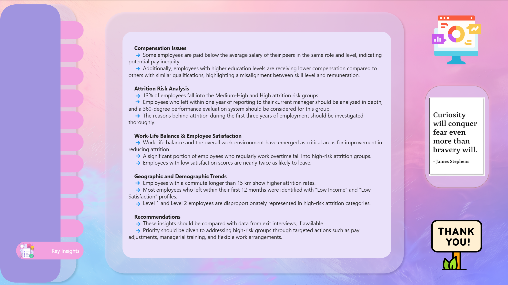

# HR Attrition Analysis: Turning Data into Retention Strategy | SQL & Power BI 📊

## 🎯 Business Problem: The "Silent Wave" of Departures
In a large organization of 1,470 employees, data reveals a **16.12% attrition rate**, resulting in the loss of 237 talents. This project moves beyond simple metrics to identify the "why" and "when" behind employee departures, providing a strategic roadmap for retention.

## 🛠️ Project Ecosystem
* **SQL:** Data extraction and preliminary risk profiling.
* **Power BI:** Advanced dashboard design with interactive "What-If" simulations.
* **Analysis Focus:** Bridging the gap between technical data structures and practical business insights.

---

## 🔍 Deep-Dive Insights (The Data Story)

### 1. The Critical "First 3 Years" & Demographics
* **Tenure Risk:** Employees with 0-3 years of total working experience show a staggering **38.2% attrition rate**.
* **The Manager Effect:** A massive **32.3%** of employees leave within their first year under a new manager, highlighting a potential gap in leadership alignment.
* **Young Talent:** 27.9% of employees under the age of 30 are leaving, signaling a loss of future leadership.

*Above: Detailed demographic breakdown and the "First Year Jolt" analysis.*

### 2. Work-Life Balance & Burnout
* **Balance Matters:** Those with "Bad" work-life balance are twice as likely to leave (**31.3%** vs **14.2%**).
* **Overtime Factor:** Regular overtime is a primary driver for the High-Risk attrition group.
* **Commute Distance:** Employees living further than **15 km** from the office have a significantly higher attrition rate (**20.6%**).

### 3. Compensation & Skill Alignment
* **The Pay Gap:** Attrition in the low-income group (**18.4%**) is nearly double that of high-income earners (**10.8%**).
* **Education Mismatch:** Employees with higher education levels (Masters/PhD) often receive lower relative pay compared to peers, creating an "equity perception" issue.

---

## 📈 Dashboard Portfolio

### 🖼️ Executive Summary & Interactive Landing Page
A bird's-eye view of organizational health, tracking Attrition by Department (R&D and Sales identified as "Hot Zones").

### 🖼️ Deep-Dive Analysis: Who Is Leaving?
Detailed demographic and tenure-based segmentation of at-risk employees.

### 🖼️ Risk Segmentation & Decomposition
Identifying the **13% of employees** currently in Medium-High or High-Risk categories.

### 🖼️ Strategic "What-If" Simulation & Executive Insights
*Simulated Scenario: A $3,000 salary increase for high-risk groups could potentially retain **31%** of at-risk talent.*

---

## 💡 Strategic Recommendations (The Action Plan)

1.  **Equity-Based Pay Adjustments:** Prioritize salary benchmarks for Level 1 & 2 employees and those with advanced degrees to ensure competitive alignment.
2.  **Managerial 360 Feedback:** Implement leadership training and feedback systems for departments with high "First Year with Manager" attrition.
3.  **Flexibility Models:** Introduce remote or hybrid work options for employees with long commutes (>15km) to improve retention.
4.  **Targeted Retention:** Use the High-Risk profiling to initiate proactive "stay interviews" with the 13% of the workforce most likely to leave.

---

## 📢 Featured on LinkedIn

I shared the What-If Analysis of this project on LinkedIn. 

You can join the discussion and see the visual presentation here:

[**🔗 View the Project Highlight on LinkedIn**](https://www.linkedin.com/feed/update/urn:li:activity:7356746464565379072/)

---

### 📩 Contact Information
**Müjde Güner** – *Data Analytics Specialist (MSc IT)*
[LinkedIn](https://linkedin.com/in/mujde-guner-msc) | [Email](mailto:mujdeguner@gmail.com)
